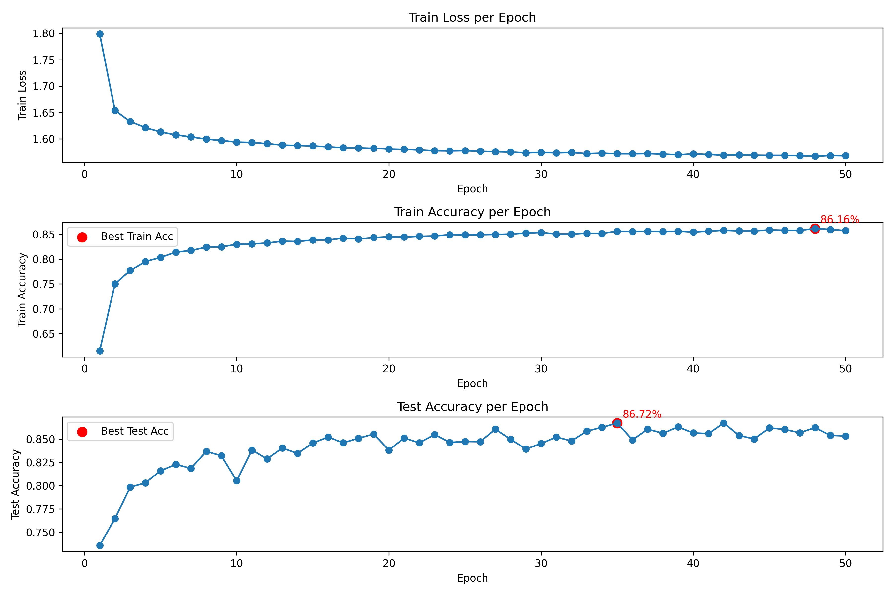

# IF STDP MNIST Recognition

English / [中文](readme_zh.md)

↑ 点击切换语言

This project implements an **MNIST recognition** system using the **IF** neuron model combined with the **STDP** optimization method and **gradient descent** for optimizing the fully connected layer. The accuracy on the test set reached **86.72%** after **50 Epochs** of training. With more refined hyperparameter tuning, the accuracy can be further improved.

The figure below shows the trend of loss and accuracy changes during the training process.



**Training Time Reference**: On an **NVIDIA RTX 3080 Ti GPU**, training for **50 Epochs** takes approximately **1 hour and 30 minutes**.

## Table of Contents

- [Environment Setup](#environment-setup)
- [Multi-language Support](#multi-language-support)
- [File Structure](#file-structure)
- [License](#license)
- [Contribution](#contribution)

## Environment Setup

```
torch==2.5.1+cu118
torchvision==0.20.1
spikingjelly==0.0.0.0.14
```

## Multi-language Support

To make the code easier to understand for developers from different language backgrounds, this project provides comments in both English and Chinese.

## File Structure

The project structure is as follows:

```
IF_STDP/
│
├── data/ 
│   └── MNIST
│
├── model/ 
│   └── best_model.pth
│
├── plot/ 
│   ├── plot.ipynb
│   ├── plot.png
│   └── train.csv
│
├── utils/
│   ├── __init__.py
│   ├── train_en.py
│   └── train_zh.py
│
├── main.py
├── readme.md
├── readme_zh.md
└── requirements.txt
```

## License

This project is licensed under the MIT License. For more details, please refer to the [LICENSE](LICENSE) file.

## Contribution

All forms of contributions are welcome! Whether it's reporting bugs or suggesting improvements, your help is greatly appreciated!!