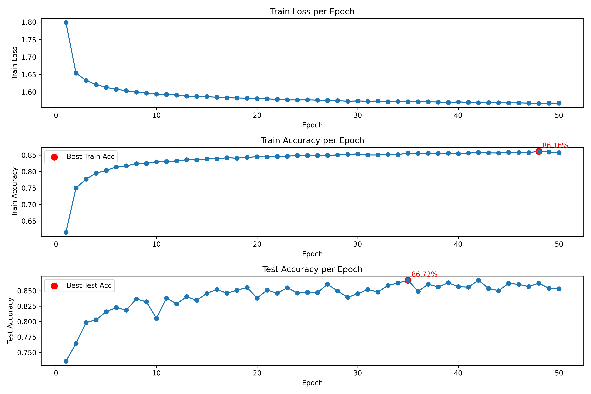

# IF STDP MNIST手写数字识别

[English](readme.md)  /  中文

↑ Click the link above to switch languages

本项目通过 **IF** 神经元模型结合 **STDP** 优化方法 同时使用 **梯度下降** 优化全连接层 实现了一个 **MNIST手写数字识别** 的项目 测试集准确率在 **50个Epochs** 的情况下达到了 **86.72%** 如果进行更细致的调参 准确率会进一步提升

下图展示了该模型在训练过程中的损失与准确率变化趋势



**训练时长参考**: 在 **NVIDIA RTX 3080 Ti GPU** 上 训练 **50个Epochs** 的总耗时约 **1小时30分**

## 目录

- [环境配置](#环境配置)
- [多语言支持](#多语言支持)
- [文件结构](#文件结构)
- [许可证](#许可证)
- [贡献](#贡献)

## 环境配置

```
torch==2.5.1+cu118
torchvision==0.20.1
spikingjelly==0.0.0.0.14
```

## 多语言支持

为了让不同语言背景的开发者更容易理解代码 本项目的注释提供了英文和中文两种版本

## 文件结构

项目的文件结构如下

```
IF_STDP/
│
├── data/ 
│   └── MNIST
│
├── model/ 
│   └── best_model.pth
│
├── plot/ 
│   ├── plot.ipynb
│   ├── plot.png
│   └── train.csv
│
├── utils/
│   ├── __init__.py
│   ├── train_en.py
│   └── train_zh.py
│
├── main.py
├── readme.md
├── readme_zh.md
└── requirements.txt
```

## 许可证

本项目使用 MIT 许可证 有关详细信息 请参阅 [LICENSE](LICENSE) 文件

## 贡献

欢迎所有形式的贡献！无论是报告错误还是提出建议 非常感谢！！